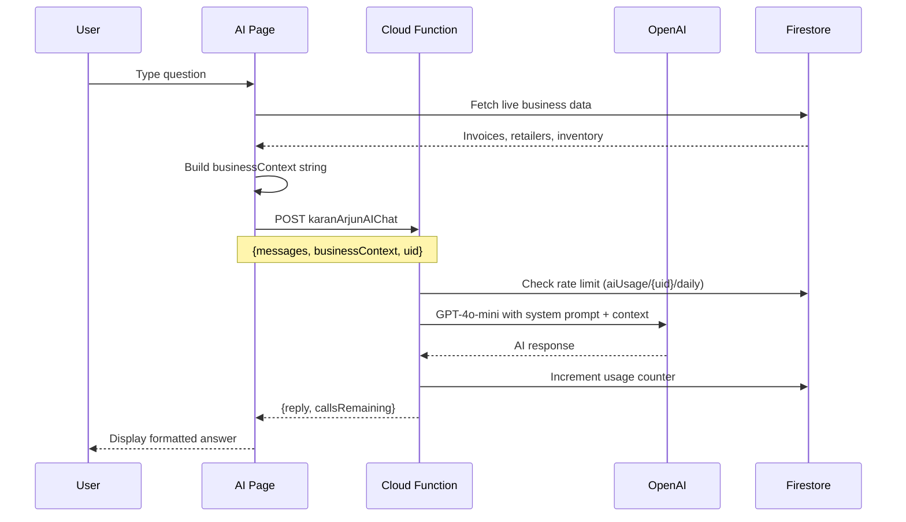

# AI Advisor

The AI Advisor is a **GPT-4o-mini powered business intelligence assistant** that answers questions about your sales, inventory, and customers using live Firestore data. It is the premium feature of the platform.

**Files:** `src/pages/AIAdvisorPage.tsx` (17KB), `KARANARJUNKSKPVTLTD/functions/src/karanArjunAI.ts`

## What You Can Ask

- "What is my total revenue this week?"
- "Which retailer owes me the most money?"
- "What are my top 3 products by sales volume?"
- "How does this month compare to last month?"
- "Which items are running low on stock?"
- "Show me all unpaid invoices over ₹50,000"

## How It Works



## Business Context Builder

Before calling the AI, the frontend collects and packages live data:

```typescript
// AIAdvisorPage.tsx
const businessContext = `
Business name: ${tenantData.businessName}
Date: ${today}

Revenue Summary:
- This month: ₹${revenueThisMonth.toLocaleString('en-IN')}
- Last month: ₹${revenueLastMonth.toLocaleString('en-IN')}
- Today: ₹${todayRevenue.toLocaleString('en-IN')}

Top Retailers:
${topRetailers.map(r => `- ${r.name}: ₹${r.outstanding} outstanding`).join('\n')}

Inventory alerts:
${lowStockItems.map(i => `- ${i.name}: ${i.stock} ${i.unit} remaining`).join('\n')}

Recent invoices:
${recentInvoices.slice(0, 10).map(i =>
  `- INV-${i.id}: ₹${i.grandTotal} to ${i.buyerName} (${i.status})`
).join('\n')}
`;
```

## System Prompt

The Cloud Function includes a strict system prompt:

```typescript
const systemPrompt = `You are an expert Indian business advisor for KaranArjun SaaS.
You speak helpfully and concisely using Indian business terminology.

${businessContext}

Answer based on this live data. Use ₹ for currency. Keep responses under 300 words.
Use markdown formatting (bold, bullets). Always end with one actionable tip.`;
```

## Rate Limiting

| Plan | Daily AI Calls |
|---|---|
| Free | 5 calls/day |
| Starter | 20 calls/day |
| Professional | 50 calls/day |

The counter is stored in Firestore:
```
aiUsage/{uid}/daily/{YYYY-MM-DD}
{ calls: 12, uid: "...", date: "2025-03-17" }
```

When the limit is hit, the API returns `HTTP 429` and the UI shows a friendly upgrade prompt.

## Security

| Layer | Implementation |
|---|---|
| Firebase App Check | Every request must have `X-Firebase-AppCheck` header |
| CORS | Only `karanarjun.in` and Firebase hosting URLs allowed |
| Rate limit | Server-enforced via Firestore increment |
| Secret | `OPENAI_API_KEY` stored as Firebase Secret (never in code) |

## Cloud Function Details

- **Runtime**: Node.js 20 (Gen 2)
- **Region**: us-central1
- **Timeout**: 30 seconds
- **Memory**: 256MiB
- **Model**: gpt-4o-mini (fastest + cheapest GPT-4 tier)
- **Token limit**: 512 output tokens

## Conversation Memory

The AI page maintains chat history in component state. Up to **10 previous messages** are sent to the API for context (sliding window):

```typescript
const payload = {
  messages: chatHistory.slice(-10),  // Last 10 exchanges
  businessContext,
  uid: currentUser.uid
};
```
