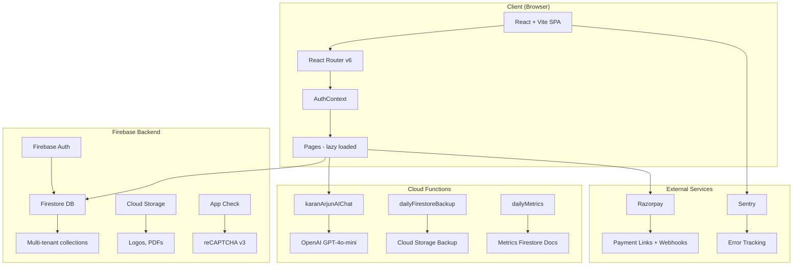
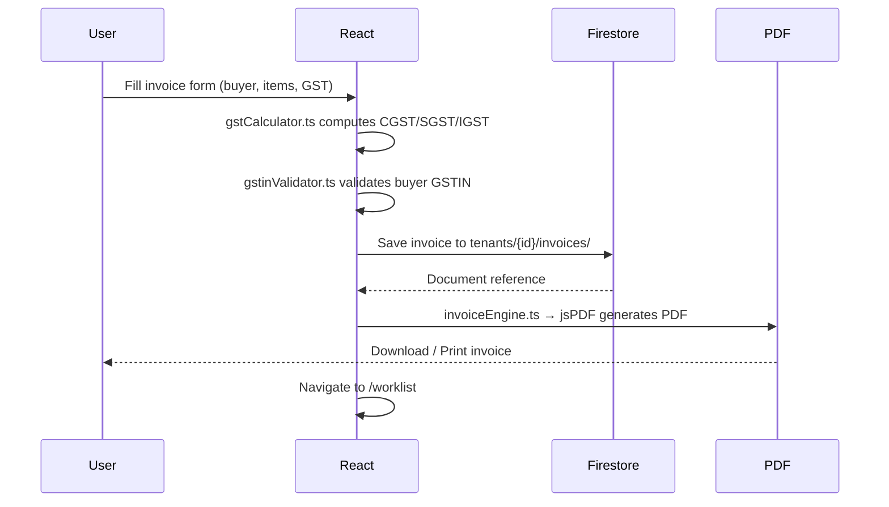

# Architecture

KaranArjun SaaS uses a **multi-tenant, Firebase-first** architecture. Each business (tenant) gets isolated data. The React frontend is fully code-split for fast initial load.

## System Architecture



## Multi-tenant Data Isolation

Every business is a **tenant**. All data lives under `tenants/{tenantId}/...` in Firestore. No tenant can ever see another tenant's data.

```
Firestore
├── users/                     ← User profiles & role assignments
│   └── {uid}/
├── tenants/                   ← One document per business
│   └── {tenantId}/
│       ├── settings/          ← Business config, roles, invoice settings
│       ├── retailers/         ← Buyer CRM records
│       ├── products/          ← Product catalog
│       ├── invoices/          ← All B2B invoices
│       ├── pos_orders/        ← Counter POS transactions
│       ├── inventory/         ← Stock with batch tracking
│       ├── warehouses/        ← Multi-location stock
│       ├── payment_links/     ← Razorpay payment links
│       └── ai_usage/          ← AI rate limiting
└── aiUsage/                   ← Cross-tenant AI rate counters
```

## Code Splitting Strategy

The app reduces its initial JS bundle from ~2.4MB → ~400KB by lazy-loading every page:

```typescript
// App.tsx — every page is a separate async chunk
const POSPage    = lazy(() => import('./pages/POSPage'));
const WorklistPage = lazy(() => import('./pages/WorklistPage'));
// ... 46 more pages
```

A `<Suspense>` boundary wrapped in `<PageLoader>` (spinner) shows while chunks load.

## Design System

All styling uses **CSS custom properties** (design tokens) defined in `index.css`:

```css
:root {
  --primary: #00b894;        /* brand green */
  --primary-light: #55efc4;
  --surface-base: #0a0e1a;   /* dark background */
  --surface-raised: #111827;
  --surface-border: #1f2937;
  --text-primary: #f9fafb;
  --text-secondary: #9ca3af;
}
```

Components use these variables — switching themes means changing just the root variables.

## Request Lifecycle — Invoice Creation



## Performance Optimizations

| Optimization | Detail |
|---|---|
| Code splitting | 48 lazy-loaded page chunks |
| Firestore listeners | `onSnapshot` only where real-time needed |
| Offline support | `OfflineBanner.tsx` detects connection loss |
| Error boundaries | `ErrorBoundary.tsx` prevents full-app crashes |
| App Check | reCAPTCHA v3 protects Cloud Functions from abuse |
