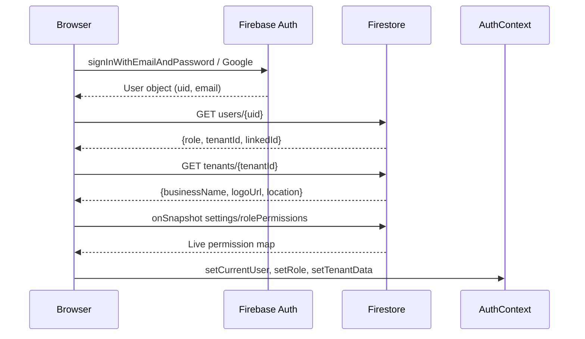

# Auth & RBAC

Authentication and access control are handled by `AuthContext.tsx`. The system supports **5 user roles** with **per-screen, per-tenant configurable permissions**.

## Authentication Flow



## User Roles

| Role | Who | Access |
|---|---|---|
| `admin` | Business owner / Arjun | Full access to all screens |
| `analyst` | Manager / accountant | All screens except admin tools |
| `retailer` | A buyer with login | Only their own portal |
| `manufacturer` | A supplier with login | Only their own portal |
| `customer` | End consumer | Settings only |

**Master Admin override:** Any email containing `arjuntanpure` or `arjutanpure` is automatically given `admin` role with `tenantId = 'master'` regardless of their Firestore document.

## Tenant Isolation

Every user belongs to exactly one **tenant** (business entity). The `tenantId` is stored in their `users/{uid}` document.

```typescript
// tenantPath.ts — ensures all queries are scoped
export function getTenantCollection(db, tenantId, ...path) {
  return collection(db, 'tenants', tenantId, ...path);
}
export function getTenantDoc(db, tenantId, ...path) {
  return doc(db, 'tenants', tenantId, ...path);
}
```

No query ever touches another tenant's data — all paths go through `getTenantCollection()` or `getTenantDoc()`.

## Role Permissions Matrix

Permissions are stored in Firestore at `tenants/{tenantId}/settings/rolePermissions` and **live-synced** via `onSnapshot`. Owners can customize which screens each role can access.

Default permissions:

| Screen | admin | analyst | retailer | manufacturer |
|---|---|---|---|---|
| dashboard | ✅ | ✅ | ❌ | ❌ |
| pos | ✅ | ✅ | ❌ | ❌ |
| worklist | ✅ | ✅ | ❌ | ❌ |
| inventory | ✅ | ✅ | ❌ | ❌ |
| admin | ✅ | ❌ | ❌ | ❌ |
| schema_builder | ✅ | ❌ | ❌ | ❌ |
| manage_retailers | ✅ | ❌ | ❌ | ❌ |
| online_orders | ✅ | ❌ | ❌ | ❌ |

## ProtectedRoute Component

Every authenticated page is wrapped in `<ProtectedRoute screenKey="...">`:

```typescript
// ProtectedRoute.tsx
function ProtectedRoute({ screenKey, children }) {
  const { currentUser, userRole, permissions, loading } = useAuth();
  if (loading) return <PageLoader />;
  if (!currentUser) return <Navigate to="/login" />;
  if (screenKey && !permissions[userRole]?.[screenKey]) {
    return <AccessDenied />;
  }
  return children;
}
```

## Portals (Role-Specific Login)

`retailer` and `manufacturer` users get a completely different UI — no sidebar, no admin tools. The layout is detected by route prefix:

```typescript
// App.tsx
const portalPaths = ['/retailer-portal', '/manufacturer-portal'];
if (portalPaths.some(p => location.pathname.startsWith(p))) {
  return <PortalLayout />;
}
```

Portal users see only data **linked to their `linkedId`** (their retailer or manufacturer document ID).

## Context API

```typescript
// Provided by AuthContext
interface AuthContextType {
    currentUser: User | null;
    userRole: UserRole | null;      // 'admin' | 'analyst' | ...
    tenantId: string | null;        // Firestore tenant scoping key
    tenantData: TenantData | null;  // Business name, logo, etc.
    linkedId: string | null;        // For retailer/manufacturer logins
    permissions: RolePermissions;   // Live from Firestore
    loading: boolean;
    logout: () => Promise<void>;
}
```

Consume anywhere with:
```typescript
const { currentUser, userRole, tenantId, permissions } = useAuth();
```
