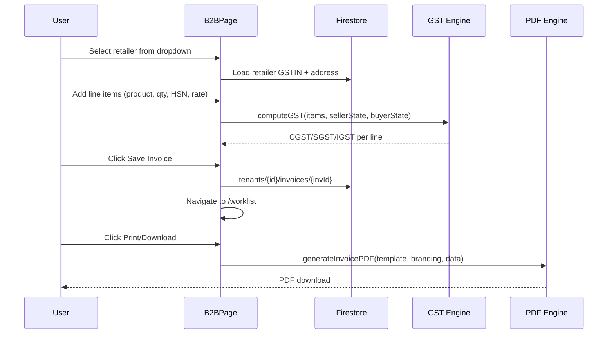

# B2B Invoicing

The B2B Invoice module generates **GST-compliant tax invoices** for wholesale transactions between businesses. It supports full GSTIN validation, HSN codes, GST slab calculation, and PDF export.

**File:** `src/pages/B2BInvoicePage.tsx` (46KB)

import { Callout } from 'nextra/components'

<Callout type="warning">
B2B invoices are DIFFERENT from POS orders. POS is for walk-in cash customers. B2B invoices are for registered retailer buyers with GSTIN numbers and credit terms.
</Callout>

## Invoice Features

- Select buyer from registered Retailers CRM or enter manually
- GSTIN live validation (format check + state code extraction)
- Multiple line items with HSN codes, quantities, rates, and units
- Auto-calculate CGST + SGST (intra-state) or IGST (inter-state) based on seller vs buyer GSTIN state codes
- Apply cash discount or trade discount
- Round-off to nearest rupee
- Preview invoice before saving
- Save to Worklist (`/worklist`) for dispatch and payment tracking
- Export PDF using `invoiceEngine.ts`

## GST Calculation Logic

`gstCalculator.ts` handles all tax computation:

```typescript
function calculateGST(items, sellerState, buyerState) {
  const isInterState = sellerState !== buyerState;
  return items.map(item => {
    const taxable = item.qty * item.rate - item.discount;
    const gstAmount = taxable * (item.gstRate / 100);
    return isInterState
      ? { ...item, igst: gstAmount, cgst: 0, sgst: 0 }
      : { ...item, igst: 0, cgst: gstAmount/2, sgst: gstAmount/2 };
  });
}
```

## GSTIN Validation

`gstinValidator.ts` validates GSTIN in real-time as the user types:

```typescript
// Format: 2-digit state code + 10-char PAN + 1Z + 1 checksum
const GSTIN_REGEX = /^[0-9]{2}[A-Z]{5}[0-9]{4}[A-Z]{1}[1-9A-Z]{1}Z[0-9A-Z]{1}$/;

export function validateGSTIN(gstin: string): GSTINValidationResult {
  const clean = gstin.trim().toUpperCase();
  if (!GSTIN_REGEX.test(clean)) return { valid: false, error: 'Invalid format' };
  const stateCode = parseInt(clean.substring(0, 2));
  const stateName = STATE_CODES[stateCode];
  return { valid: true, stateCode, stateName };
}
```

The state name is shown in green below the input when valid (e.g., "Maharashtra").

## Invoice Data Flow



## Firestore Invoice Document

```typescript
// tenants/{tenantId}/invoices/{invoiceId}
{
  invoiceNumber: "INV-2025-001",
  invoiceType: "b2b",
  buyerId: "retailer-doc-id",
  buyerName: "Sharma Traders",
  buyerGSTIN: "27AABCT1332L1ZX",
  buyerState: "Maharashtra",
  items: [
    {
      description: "Basmati Rice 5kg",
      hsn: "1006",
      qty: 100,
      unit: "Bag",
      rate: 450,
      discount: 0,
      gstRate: 5,
      taxableValue: 45000,
      cgst: 1125, sgst: 1125, igst: 0,
      total: 47250
    }
  ],
  subtotal: 45000,
  totalCGST: 1125,
  totalSGST: 1125,
  totalIGST: 0,
  grandTotal: 47250,
  status: "pending",   // 'pending' | 'dispatched' | 'paid'
  createdAt: Timestamp,
  dueDate: Timestamp
}
```

## GST Slabs Supported

| Rate | Common Items |
|---|---|
| 0% | Fresh produce, milk, books |
| 5% | Rice, wheat, packaged food |
| 12% | Processed foods, clothes |
| 18% | Electronics, most manufactured goods |
| 28% | Luxury, tobacco, vehicles |

## Invoice Status Lifecycle

```
Draft → Pending → Dispatched → Paid
                ↘ Cancelled
```

Status updates happen from the **Worklist** page, not the invoice creation page.
