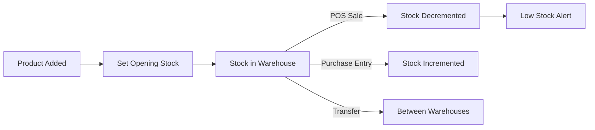

# Inventory & Batches

The Inventory module manages stock levels across one or more **warehouses**, with support for batch tracking (expiry dates, batch numbers) and barcode label generation.

**Files:** `src/pages/InventoryBatchPage.tsx` (16KB), `src/pages/WarehousePage.tsx` (15KB), `src/pages/BarcodePage.tsx` (17KB)

## Core Concepts

| Concept | Description |
|---|---|
| Product | The item being sold (name, SKU, HSN, GST rate, MRP) |
| Batch | A specific lot of a product (batch number, expiry, cost price) |
| Stock | Quantity of a batch at a specific warehouse |
| Warehouse | A physical storage location |
| Barcode | SKU or batch-level barcode for scanning at POS |

## Warehouses

A business can have multiple locations (e.g., Main Godown, Shop Floor, Cold Storage). Each warehouse has its own stock levels.

```
tenants/{tenantId}/warehouses/{warehouseId}
{
  name: "Main Godown",
  location: "Pune",
  isDefault: true
}
```

## Inventory Flow



## Batch Tracking

For FMCG and pharmaceuticals, each stock lot is tracked as a batch:

```typescript
// tenants/{tenantId}/inventory/{productId}/batches/{batchId}
{
  batchNumber: "BATCH-2025-03",
  manufacturingDate: Timestamp,
  expiryDate: Timestamp,
  costPrice: 420,
  mrp: 500,
  currentStock: 150,
  warehouseId: "main-godown"
}
```

Stock at POS or invoicing automatically pulls from the **earliest-expiry batch** (FEFO — First Expiry, First Out).

## Barcode Labels

`BarcodePage.tsx` generates printable barcode label sheets:

- Select products/batches to print
- Choose label size (28x19mm, 38x25mm, 50x25mm, 57x32mm)
- Set number of copies per item
- Preview layout before printing
- Browser `window.print()` with `@media print` styles

Barcode format: Code-128 or QR code, encoding the product SKU.

## Stock Adjustments

Manual adjustments for damage, theft, or corrections:

```typescript
// Adjustment types
type AdjustmentReason = 
  | 'damage'       // Stock damaged
  | 'theft'        // Stock lost
  | 'correction'   // Manual count correction
  | 'return'       // Customer return
  | 'opening';     // Opening stock entry
```

## Low Stock Alerts

Dashboard shows a "Low Stock" card when any product's total stock falls below its reorder level:

```typescript
const isLowStock = product.currentStock < product.reorderLevel;
```

## Firestore Paths

```
tenants/{tenantId}/products/{productId}      → Product catalog
tenants/{tenantId}/inventory/{productId}     → Stock summary
tenants/{tenantId}/inventory/{productId}/
  batches/{batchId}                          → Batch-level stock
tenants/{tenantId}/warehouses/{warehouseId}  → Location registry
tenants/{tenantId}/stockMovements/{moveId}   → Audit trail
```
