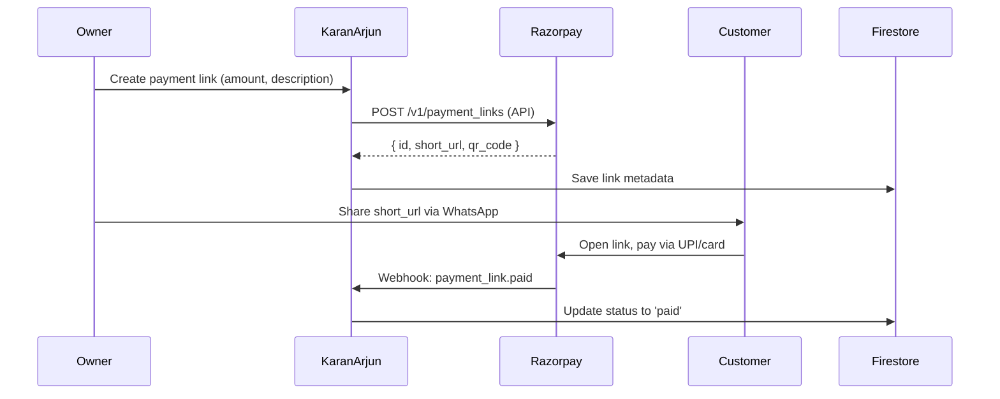

# Payment Links

The Payment Links module lets businesses create **Razorpay-powered payment links** that can be shared via WhatsApp, SMS, or QR code. Customers can pay via UPI, cards, or netbanking.

**Files:** `src/pages/PaymentLinkPage.tsx` (15KB), `src/pages/PaymentLandingPage.tsx` (9KB)

## How It Works



## Creating a Payment Link

Fields on the create form:

| Field | Example |
|---|---|
| Amount | ₹47,250 |
| Description | "Invoice INV-2025-001 payment" |
| Linked Retailer | Sharma Traders (optional) |
| Expiry | 24 hours / 48 hours / 7 days |
| Notes | Customer reference number |

## Payment Landing Page

`PaymentLandingPage.tsx` at `/pay/{linkId}` is the **public-facing payment page** that customers see after clicking the shared link:

- Business name and logo
- Amount due with description
- Razorpay checkout button
- Payment success confirmation screen

This page works WITHOUT login — it's the consumer-facing side.

## Payment Link Statuses

```
created → pending → paid
              ↘ expired
              ↘ cancelled
```

## Firestore Schema

```typescript
// tenants/{tenantId}/payment_links/{linkId}
{
  razorpayLinkId: "plink_xyz123",
  shortUrl: "https://rzp.io/l/abcd1234",
  amount: 47250,
  currency: "INR",
  description: "Invoice INV-2025-001",
  retailerId: "sharma-traders-id",
  status: "pending",
  expiresAt: Timestamp,
  paidAt: Timestamp | null,
  createdBy: "uid",
  createdAt: Timestamp
}
```

Also stored publicly (without tenant isolation) for payment page access:
```
paymentLinks_public/{linkId}
{
  businessName: "KaranArjun Distribution",
  logoUrl: "...",
  amount: 47250,
  description: "Invoice payment",
  status: "pending"
}
```

## QR Code

Every payment link automatically generates a QR code from Razorpay that can be printed and posted at the shop counter:

```javascript
// QR code rendered in browser

```

## Razorpay Integration

```typescript
// Environment variable in .env
VITE_RAZORPAY_KEY_ID=rzp_live_xxxxx

// Client-side checkout
const rzp = new Razorpay({
  key: import.meta.env.VITE_RAZORPAY_KEY_ID,
  amount: link.amount * 100, // paise
  currency: 'INR',
  name: tenantData.businessName,
  description: link.description,
  image: tenantData.logoUrl,
  prefill: { contact: retailer.phone, email: retailer.email }
});
rzp.open();
```
