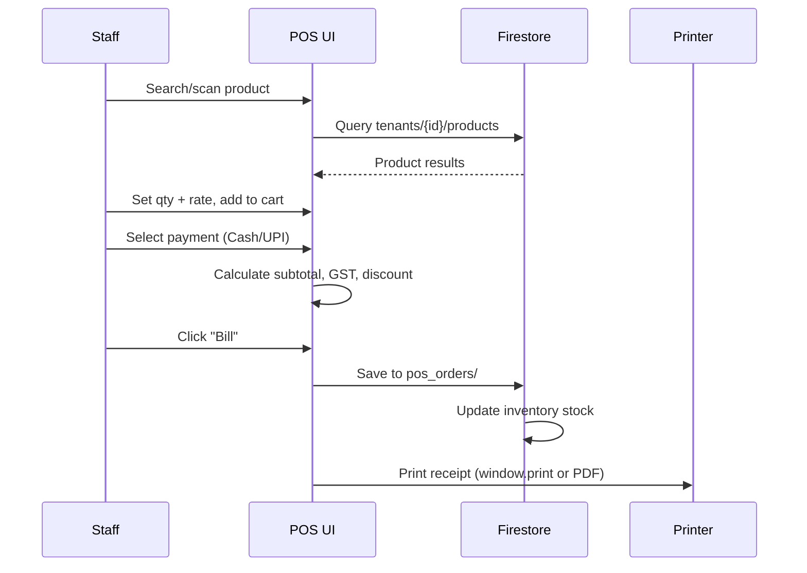

# POS & Billing

The POS (**Point of Sale**) module is the counter billing screen used for quick cash/UPI transactions — typically used by a sales person at the shop floor.

**File:** `src/pages/POSPage.tsx` (33KB — the largest single-page component)

## What It Does

- Scan or search products by name, SKU, or barcode
- Add multiple items to cart with quantity, unit, and rate
- Apply discounts (per item or cart-level)
- Choose payment method: Cash, UPI, Credit, or Split
- Generate a printable receipt or PDF bill
- Save order to Firestore + update inventory stock
- View today's POS order history inline

## POS Flow



## Cart State

The cart is managed locally with React state — no Firestore writes until the Bill button is pressed:

```typescript
interface CartItem {
  productId: string;
  name: string;
  sku: string;
  qty: number;
  unit: string;
  rate: number;
  discount: number;
  gstRate: number;   // 0 | 5 | 12 | 18 | 28
  total: number;
}
```

## Payment Modes

| Mode | What happens |
|---|---|
| Cash | Order saved, change calculated and shown |
| UPI | QR code displayed, order marked pending until confirmed |
| Credit | Order saved against retailer's outstanding balance |
| Split | Partial cash + partial UPI |

## Receipt & PDF

POS receipts use `window.print()` with a `@media print` CSS stylesheet — the sidebar is hidden and only the receipt div is printed. For PDF, `invoiceEngine.ts` generates a jsPDF document.

## Firestore Path

```
tenants/{tenantId}/pos_orders/{orderId}
{
  items: CartItem[],
  subtotal: number,
  gstAmount: number,
  discount: number,
  grandTotal: number,
  paymentMode: 'cash' | 'upi' | 'credit' | 'split',
  retailerId?: string,
  staffUid: string,
  createdAt: Timestamp
}
```

## Keyboard Shortcuts

- `Enter` on product search → add first result to cart
- `Esc` → clear search / close modal
- `F2` → focus quantity field of last cart item
