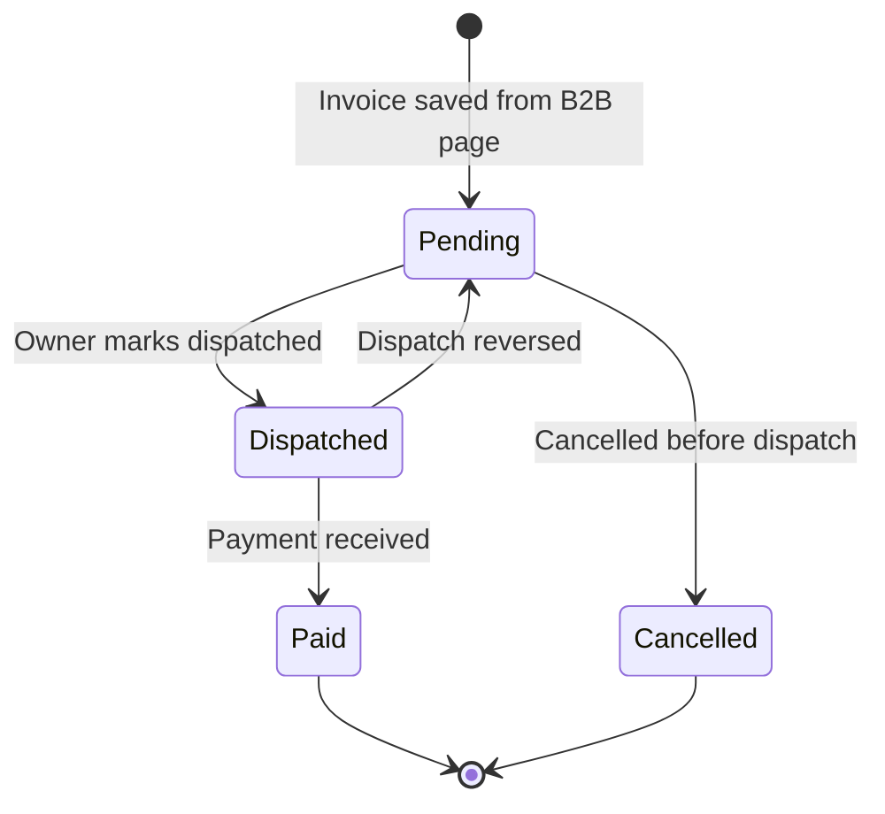

# Worklist

The Worklist is the **invoice pipeline management** screen — it shows all saved B2B invoices and allows the owner to track, update, dispatch, and collect payment.

**Files:** `src/pages/WorklistPage.tsx` (22KB), `src/pages/WorklistDetailsPage.tsx` (49KB — the largest page in the app)

## What the Worklist Does

- Shows all invoices grouped by status: Pending, Dispatched, Paid, Cancelled
- Filter by date range, retailer, amount, or search
- Click any invoice to open the detail drawer
- Mark as Dispatched (with delivery date)
- Mark as Paid (with payment mode: Cash/UPI/NEFT)
- Generate Outstanding Statement (multi-invoice PDF for a retailer)
- Send WhatsApp payment reminder
- Delete or edit an invoice

## Invoice Status Board



## Worklist Page Structure

```
WorklistPage
├── StatusTabs (Pending | Dispatched | Paid | Cancelled)
├── SearchBar + DateFilter + RetailerFilter
├── InvoiceCard[] (list)
│   ├── Retailer name, invoice number, amount
│   ├── Status badge
│   └── Quick actions (WhatsApp, PDF, Open)
└── DetailDrawer (WorklistDetailsPage)
    ├── Full invoice breakdown
    ├── Line items table
    ├── GST summary
    ├── Status update buttons
    ├── Outstanding items (multi-invoice)
    └── PDF export
```

## Outstanding Statement

When a retailer has multiple unpaid invoices, the owner can generate an **Outstanding Statement** — a single PDF listing all pending amounts:

```typescript
// OutstandingInvoice.tsx component
function OutstandingInvoice({ retailerId, invoices }) {
  const unpaid = invoices.filter(i =>
    i.buyerId === retailerId && i.status !== 'paid'
  );
  const totalOutstanding = unpaid.reduce((s, i) => s + i.grandTotal, 0);
  // Renders a PDF-ready summary table
}
```

## WhatsApp Payment Reminder

From within WorklistDetailsPage, clicking "Send Reminder" opens:

```
https://wa.me/91{phone}?text=
Dear {retilerName}, your invoice INV-2025-001 
of ₹47,250 is due. Please make payment. 
Thank you, {businessName}
```

The message is pre-filled from invoice data and the user's phone is pre-populated.

## Firestore Queries

```typescript
// WorklistPage.tsx
const q = query(
  collection(db, 'tenants', tenantId, 'invoices'),
  where('status', '==', selectedTab),
  orderBy('createdAt', 'desc'),
  limit(50)
);
```

Real-time updates via `onSnapshot` — new invoices created by staff appear automatically.
