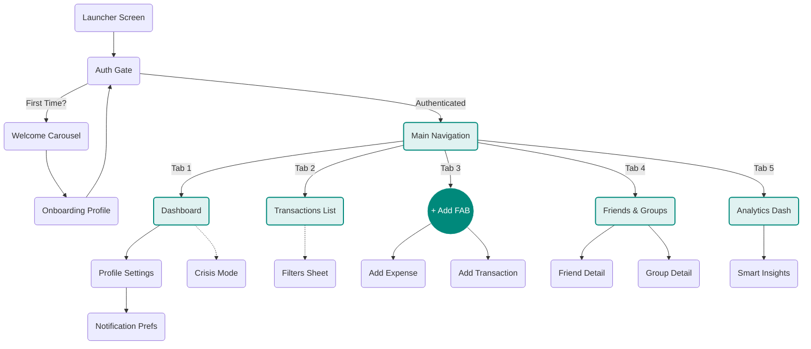

# Welcome to Fiinny Wiki

**The Single Source of Truth for Fiinny Engineering.**

This internal portal hosts documentation for all Fiinny products — the **Fiinny Personal Finance App** (Flutter), **KaranArjun Retailer SaaS** (React), **Marketing Website** (Next.js), and **Backend Services** (Firebase).

---

## Our Products

### 📱 Fiinny — Personal Finance App
A Flutter app for personal expense tracking, budgeting, and financial intelligence. Available on Android.
- Firebase project: `lifemap-72b21`
- Main entry: `lib/main.dart`
- Docs: [App Architecture](/mobile-app/architecture)

### 🏪 KaranArjun SaaS — Retailer Management Platform
A React web app for B2B invoice management, inventory, payments, and AI business advisory. Built for Indian SMBs.
- Live URL: [karanarjun.in](https://karanarjun.in)
- Firebase project: `karanarjun-pvt-ltd`
- Folder: `KARANARJUNKSKPVTLTD/`
- AI advisor: [AI Intelligence](/ai-intelligence#karanarjun-ai-advisor)

---

## Quick Links

- [App Architecture](/mobile-app/architecture)
- [Core Codebase](/mobile-app/core)
- [AI Intelligence](/ai-intelligence)
- [Deployment Guides](/deployment)

import { Callout } from 'nextra/components'

<Callout type="info">
**New Joiners:** Read [Core Codebase](/mobile-app/core) for the Fiinny app (`main.dart`), or jump straight to [AI Intelligence](/ai-intelligence) to understand both AI systems.
</Callout>

## App Flow

Visual map of the application screens. Click on nodes to jump to their documentation.

